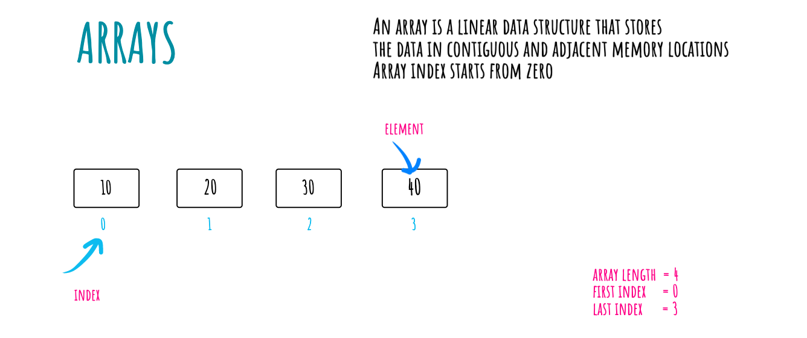

******Arrays******
---

Array is the linear data structure that stores the data in contigious memory locations. Array index starts from zero (0)

- Static Arrays (fixed in size)
- Dynamic Arrays (Automatic Resize)

Array in javascript are object in which the indexes acts as keys.

****Complexities****
---

**Time Complexity**

| Access        | Search        | Insertion     | Deletion      | Push          | Pop           |
|:-------------:|:-------------:|:-------------:|:-------------:|:-------------:|:-------------:|
| O(1)          | O(n)          | O(n)          | O(n)          | O(1)          | O(1)          |

**Space Complexity**

O(n)
