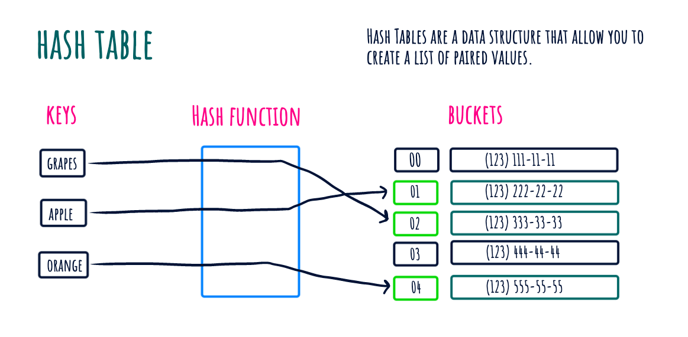
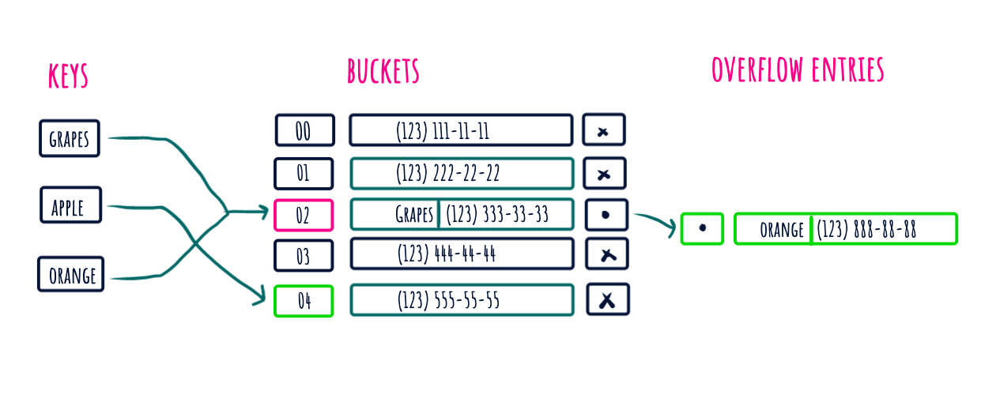

******Hash Table******
---

Hash Table is a data structure which stores data in an associative manner. In a hash table, data is stored in an array format, where each data value has its own unique index value. Access of data becomes very fast

visiual representation of collision in hash tables, if the collisions happens, when the hash function generates the same index for more than one key, then the time complexity at that stage for the lookup will be O(n)

---

******Complexities******
---

****Time Complexity****

| Access        | Search        | Insertion     | Deletion      | 
|:-------------:|:-------------:|:-------------:|:-------------:|
| O(1)          | O(1)          | O(1)          | O(1)          |

****Space Complexity****
O(n)
---

******Merits and Demerits******

| **Merits**           | **Demerits**        |
|:-------------:       |   :-------------:   |
| Fast Lookups         | Unordered           |
| Fast Inserts         | Slow Key iteration  |
| Flexible Keys        |                     |
---

******Key Points******
- By using the Hash table we can optimize the nested loops i.e O(n^2) to O(n).
- Good collison resolution needed in the hash tables.