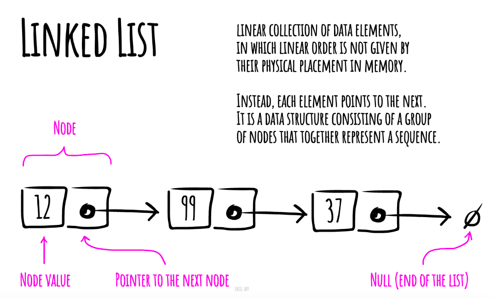

# Linked List

A linked list is a linear data structure similar to an array. However, unlike arrays, elements are not stored in a particular memory location or index. Rather each element is a separate object that contains a pointer or a link to the next object in that list.

Each element (commonly called nodes) contains two items: the data stored and a link to the next node. The data can be any valid data type.

---

******Complexities******
---

****Time Complexity****

| Access        | Search        | Insertion     | Deletion      | 
|:-------------:|:-------------:|:-------------:|:-------------:|
| O(n)          | O(n)          | O(1)          | O(1)          |

****Space Complexity****

O(n)

<h2>Difference between singly and doubly linked lists</h2>

****Singly Linked List:****
 - Each node stores a reference to the next node in the sequence
 - Traversal can only be done in one direction (forward)
 - Deleting a node requires updating the reference of the previous node to point to the next node

****Doubly Linked List:****
 - Each node stores a reference to both the next and the previous nodes in the sequence
 - Traversal can be done in both directions (forward and backward)
 - Deleting a node can be done more efficiently by updating the references of both the previous and next nodes to point to each other.

******Merits and Demerits******

| **Merits**           | **Demerits**        |
|:-------------:       |   :-------------:   |
| Fast insertion       | Slow lookups        |
| Fast deletion        | More Memory         |
| ordered              |                     |
| Flexible Keys        |                     |
---

