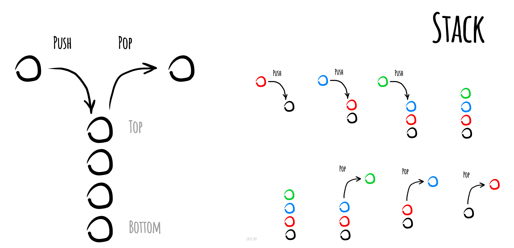

# Stack

A stack is a data structure that follows the Last-In-First-Out (LIFO) principle. It is a collection of elements where elements are added and removed from the same end, known as the top of the stack. A stack can be implemented using an array or a linked list in JavaScript.

******Complexities******
---

****Time Complexity****

| Access        | Search        | Insertion     | Deletion      | 
|:-------------:|:-------------:|:-------------:|:-------------:|
| O(n)          | O(n)          | O(1)          | O(1)          |

****Space Complexity****

O(n)

******Merits and Demerits******

| **Merits**           | **Demerits**        |
|:-------------:       |   :-------------:   |
| Fast Operations      |   Slow Lookup       |
| Fast Peek            |                     |
| Ordered              |                     |
---